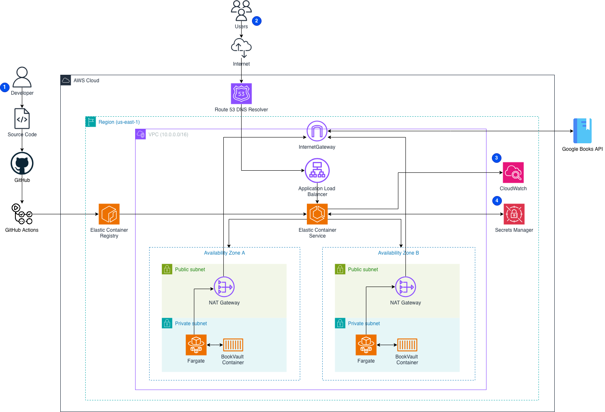

<h1 align="center">
  <br>
  <a href="docs/assets/bookvault_logo.png"></a>
  <br>
BookVault
  <br>
</h1>

<h4 align="center">BookVault is a containerized Book Catalog API deployed on AWS using Infrastructure as Code.</h4>


<p align="center">
  
  
  
  
  
</p>

<p align="center">
  <a href="#overview">Overview</a> •
  <a href="#architecture-summary">Architecture</a> •
  <a href="#api-endpoints">API Endpoints</a> •
  <a href="#local-development">Local Development</a> •
  <a href="#infrastructure">Infrastructure</a> •
  <a href="#deployment-model">Deployment Model</a> •
  <a href="#roadmap">Roadmap</a>
</p>

The service provides a clean API layer for searching and retrieving book data while integrating with the Google Books API behind the scenes. It is designed around a modern AWS deployment pattern with containerized workloads, private networking, centralized logging, secure secret handling, and automated delivery workflows.

---

## Overview

BookVault exposes a simple HTTP API for querying book information.

Instead of accessing a third-party provider directly, clients interact with BookVault through a stable, application-owned interface. The service retrieves data from Google Books, transforms the response into a simplified format, and returns normalized results to the caller.

This architecture keeps the application boundary clear and allows infrastructure, deployment, and operational concerns to be managed in a controlled way.

---

## Core Characteristics

BookVault is designed around the following principles:

* Containerized application delivery
* Infrastructure defined in Terraform
* Private application runtime in AWS
* Public traffic controlled through an Application Load Balancer
* Centralized logging with CloudWatch
* Secure secret management with AWS Secrets Manager
* Automated build and deployment workflows
* Multi-AZ deployment for better availability

---

## Architecture Summary

At a high level, BookVault follows this request path:




Supporting services include:

* **Amazon ECR** for container image storage
* **CloudWatch** for centralized logging
* **Secrets Manager** for sensitive runtime configuration
* **GitHub Actions** for CI/CD automation

More detail is available in [`docs/architecture.md`](docs/architecture.md).

---

## Main Capabilities

BookVault currently supports:

* Health checks for runtime verification
* Book search by query string
* Retrieval and transformation of external book metadata
* Containerized deployment on AWS
* Automated image build and deployment workflow

Planned improvements include HTTPS, autoscaling, caching, and richer operational monitoring.

---

## Technology Stack

### Cloud Platform

* AWS
* Amazon ECS
* AWS Fargate
* Application Load Balancer
* Amazon ECR
* Amazon CloudWatch
* AWS Secrets Manager
* Route 53

### Infrastructure

* Terraform
* Modular infrastructure layout
* Remote state support

### Application

* Python
* FastAPI
* Google Books API integration

### Delivery and Operations

* Docker
* GitHub Actions
* Git
* Shell scripting
* YAML

---

## Repository Structure

```text
bookvault/
├── README.md
├── docs/
│   ├── architecture.md
│   ├── infrastructure.md
│   ├── deployment.md
│   └── runbook.md
├── api/
│   ├── app/
│   │   └── main.py
│   ├── requirements.txt
│   └── Dockerfile
├── terraform/
│   ├── modules/
│   │   ├── vpc/
│   │   ├── ecs/
│   │   ├── alb/
│   │   └── ecr/
│   ├── environments/
│   │   ├── dev/
│   │   └── prod/
│   └── bootstrap/
├── scripts/
│   ├── build.sh
│   └── deploy.sh
└── .github/
    └── workflows/
        ├── ci.yml
        └── deploy.yml
```

The repository is structured to separate application code, infrastructure definitions, deployment automation, and operational documentation.

---

## API Endpoints

### Health Check

```http
GET /health
```

Example response:

```json
{
  "status": "ok"
}
```

---

### Search Books

```http
GET /books?q=<search_term>
```

Example:

```http
GET /books?q=dune
```

Example response:

```json
[
  {
    "title": "Dune",
    "author": "Frank Herbert",
    "published": "1965"
  }
]
```

---

### Get Book by ID

```http
GET /books/{id}
```

---

## Local Development

### Requirements

Install the following locally:

* Git
* Python 3
* Docker

### Run the application locally

From the `api` directory:

```bash
pip install -r requirements.txt
uvicorn app.main:app --reload
```

Once running, the API is available at:

```text
http://localhost:8000
```

FastAPI interactive documentation is available at:

```text
http://localhost:8000/docs
```

### Run with Docker

Build the image:

```bash
docker build -t bookvault-api .
```

Run the container:

```bash
docker run -p 8000:8000 bookvault-api
```

Test the API:

```bash
curl "http://localhost:8000/books?q=dune"
```

---

## Infrastructure

Infrastructure is provisioned with Terraform and follows a modular layout.

The AWS deployment includes:

* A dedicated VPC
* Public and private subnets across two Availability Zones
* An Internet Gateway
* NAT Gateway routing for outbound private traffic
* An Application Load Balancer
* ECS and Fargate for container orchestration and runtime
* ECR for image storage
* CloudWatch log groups
* Secrets Manager for sensitive runtime values

Additional detail is documented in [`docs/infrastructure.md`](docs/infrastructure.md).

---

## Deployment Model

The application is intended to be delivered through an automated workflow.

### Continuous Integration

CI validates changes before deployment, including:

* Application checks
* Docker image build verification
* Terraform formatting and validation

### Continuous Deployment

On deployment:

* The application image is built
* The image is pushed to Amazon ECR
* Infrastructure changes are applied
* The ECS service is updated to run the new version

Deployment details are documented in [`docs/deployment.md`](docs/deployment.md).

---

## Security Model

BookVault uses several baseline security practices:

* Application containers run in **private subnets**
* Inbound traffic is restricted to the **Application Load Balancer**
* Sensitive values are stored outside the codebase in **AWS Secrets Manager**
* Infrastructure is isolated inside a dedicated **VPC**
* Runtime logs are centralized for operational visibility

Future security improvements may include:

* HTTPS with ACM
* AWS WAF
* Stricter IAM policies
* Secret rotation
* Enhanced audit visibility

---

## Observability

Operational visibility is provided through AWS-native logging.

Current observability features include:

* Centralized container logs in CloudWatch
* Load balancer health checks
* Application health endpoint
* Deployment traceability through CI/CD workflows

Future enhancements may include metrics dashboards, tracing, and alerting.

---

## Reliability and Scaling

The system is designed with baseline resilience in mind.

### Reliability

* Workloads are distributed across two Availability Zones
* ECS can replace failed tasks automatically
* The load balancer routes traffic only to healthy targets

### Scaling

* Additional ECS tasks can be added horizontally
* The architecture supports service autoscaling
* The load balancer can distribute traffic across multiple running tasks

---

## Roadmap

Planned improvements include:

* HTTPS termination with ACM
* ECS service autoscaling
* Response caching for Google Books queries
* Blue/Green deployments
* Metrics and dashboards
* WAF protection
* Rate limiting
* Improved runbooks and operational procedures

---

## Documentation

Additional documentation is available in the `docs/` directory:

* `architecture.md` — high-level system design and request flow
* `infrastructure.md` — AWS resources, Terraform layout, and network design
* `deployment.md` — build and deployment workflow
* `runbook.md` — operational procedures and troubleshooting steps

---

## License

MIT License
